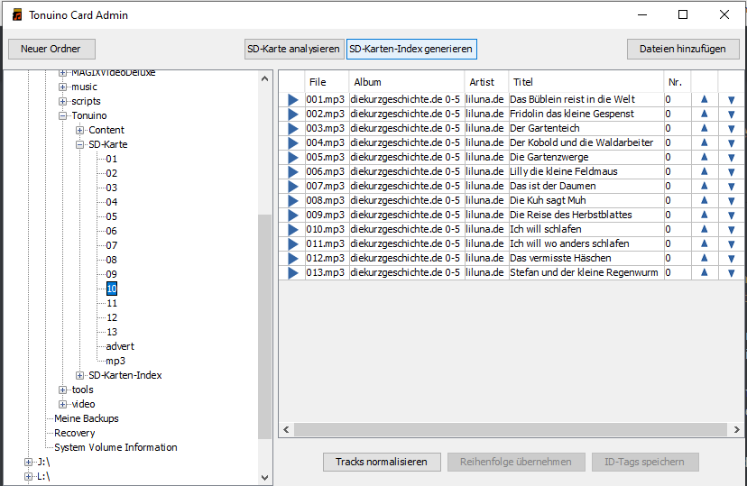

# tonuino-cardadmin

Eine einfache Applikation für die Verwaltung von [Tonuino](https://www.voss.earth/tonuino/) SD-Karten.

Für Nicht-Entwickler existieren precompiled Versionen unter */bin*


Das Programm ist in Java-Swing entwickelt und daher theoretisch überall lauffähig. Allerdings mit ein paar Einschränkungen (siehe unten).
Für Windows-User gibt es eine exe (ein installiertes Java 8 wird benötigt): [https://github.com/coschtl/tonuino-cardadmin/blob/main/TonuinoCardAdmin.exe](https://github.com/coschtl/tonuino-cardadmin/blob/main/TonuinoCardAdmin.exe)



## Folgende Funktionen habe ich umgesetzt:

* Karten können sowohl direkt als auch „offline“ in einem Ordner im Filesystem verwaltet werden
* Analyse des Karten-Inhalt mit Vorschlägen zu Änderungen
* Erstellen neuer Ordner auf der Karte
* Hinzufügen von Files
* Anzeige der ID-Tags der Files mit der Möglichkeit zum Editieren
* Abspielen der Files
* Neu-Sortierung der Files eines Ordners
* Normalisieren aller Files eines Ordners (Windows only, läuft per Shell-Aufruf, also ev. portierbar)
* Generierung eines Inhaltsverzeichnisses der Karte

## Was dem Programm noch fehlt:

* Code-Überarbeitung (es musste schnell gehen)
* Bessere Fehlerbehandlung

## Konfiguration

Das Konfigurationsfile "configuration.properties" wird im Startverzeichnis der exe gesucht.
Alternativ kann auch ein Environment-Property "cardAdminConfigFile" gesetzt werden, das den Pfad des Konfig-Files enthält.

Folgende Konfigurationsmöglichkeiten gibt es:

```
# normalizing program
# if not set, no normalizing can be done
mp3.normalizing.commandline=C:\\Program Files (x86)\\MP3Gain\\mp3gain.exe
mp3.normalizing.options = /a /k

# alternative card-roots
# i.e. for using a local folder as card-backup
alternative.card.root = D:/media/Tonuino/SD-Karte
 
# default content root
default.content.root = D:/media/Tonuino/Content

# index file location
card-index.location = D:/media/Tonuino/SD-Karten-Index
# set to csv to generate csv files
# any other string (or no value) will generate human readable files
card-index.format = csv
```